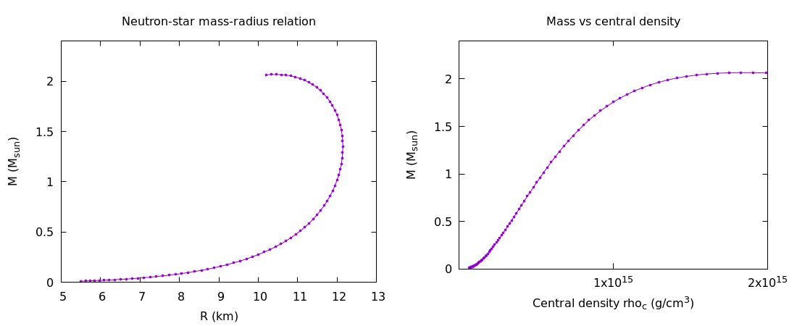
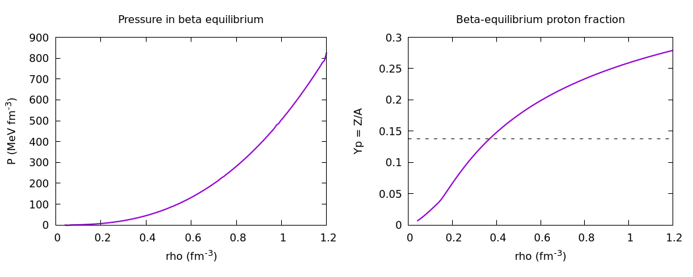

# TOV Neutron Star Solver in Fortran

Numerical solution of the Tolman–Oppenheimer–Volkoff equations for neutron stars using Fortran, including equation of state modeling and mass-radius relation calculations.

---

## Overview

This repository contains a computational pipeline written in **Fortran 2008** for studying the macroscopic structure of neutron stars.

The code reads tabulated nuclear-matter EOS data, constructs the beta-equilibrated equation of state, and solves the relativistic equations of hydrostatic equilibrium to obtain neutron-star mass–radius (M–R) sequences.

The project demonstrates numerical methods used in theoretical and computational nuclear astrophysics, including interpolation, root finding, numerical differentiation, adaptive ODE integration, and EOS processing.

## Key Computational Features

* **Adaptive RK45 Integration:** Implements an embedded fourth/fifth-order Runge–Kutta method with adaptive step-size control for solving the TOV equations.

* **Spline Interpolation:** Uses natural and not-a-knot cubic splines for smooth interpolation of the tabulated EOS and numerical derivatives required for pressure and energy-density calculations.

* **Beta-Equilibrium Modeling:** Determines the proton fraction under beta equilibrium, including electron and muon contributions.

* **EOS Construction:** Processes tabulated energy-per-particle data and constructs the corresponding pressure and energy-density relations required by the TOV solver.

* **Mass–Radius Sequences:** Solves the TOV equations for a sequence of central densities and calculates the corresponding stellar masses and radii.

* **Automated Visualization:** Generates EOS and mass–radius plots using Gnuplot scripts.

## Data

The sample dataset included in this repository (`mock_eos_data.csv`) is entirely **synthetic** and is provided solely for demonstration and testing of the numerical pipeline.

No proprietary, unpublished, or manuscript-specific numerical data are included in this repository.

The solver is designed to accept tabulated EOS data in the required input format.

## Core Equations

The numerical solver integrates the general relativistic Tolman-Oppenheimer-Volkoff (TOV) equations to determine the hydrostatic equilibrium of the star:

$$
\frac{dP}{dr}
=-\frac{
G(\epsilon+P)
\left(
m+\frac{4\pi r^3P}{c^2}
\right)
}
{
c^2 r^2
\left(
1-\frac{2Gm}{rc^2}
\right)
}
$$

$$\frac{dm}{dr}=4\pi r^2\frac{\epsilon}{c^2}$$

The macroscopic structure is closed by a barotropic equation of state $P=P(\epsilon)$. The thermodynamic pressure is computed consistently from the energy density $\epsilon$ and baryon density $\rho$ using the fundamental relation:

$$P=\rho^2\frac{d(\epsilon/\rho)}{d\rho}$$

## How to Compile and Run

### 1. Compile
gfortran -O2 -std=f2008 neutron_star.f90 -o neutron_star

### 2. Run
./neutron_star mock_eos_data.csv

### 3. Generate Figures
gnuplot P_and_Yp.gp
gnuplot MR_curve.gp

## Numerical Method

The code follows a numerical workflow consisting of the following steps:

1. Read the tabulated equation-of-state data from a CSV file.
2. Interpolate the energy per particle as a function of baryon density and isospin asymmetry.
3. Determine the beta-equilibrium composition by imposing charge neutrality and chemical equilibrium.
4. Construct the pressure and energy-density relation for beta-equilibrated matter.
5. Extend the EOS to lower densities using a polytropic representation.
6. Integrate the Tolman–Oppenheimer–Volkoff equations using an adaptive Runge–Kutta method.
7. Repeat the integration for a sequence of central densities to obtain the mass-radius relation.
8. Generate numerical output files and Gnuplot scripts for visualization.

## Sample Results

Below are the numerical visualizations automatically generated by the Gnuplot scripts using the provided synthetic dataset.

### Mass-Radius Sequence

### Equation of State (Beta-Equilibrium)

## Disclaimer

This repository is provided for educational, methodological, and demonstration purposes.
The included sample EOS dataset is synthetic and is not intended to reproduce any specific published EOS, microscopic interaction model, or research dataset.

The numerical results obtained from the sample data should therefore not be interpreted as physical predictions or as results from a specific nuclear interaction.

The solver is designed to accept tabulated EOS data as input and can be adapted for research applications with appropriate physical input data and validation.

## Author

Parsa Arabzadeh Asadi

MSc Physics  
University of Tehran
